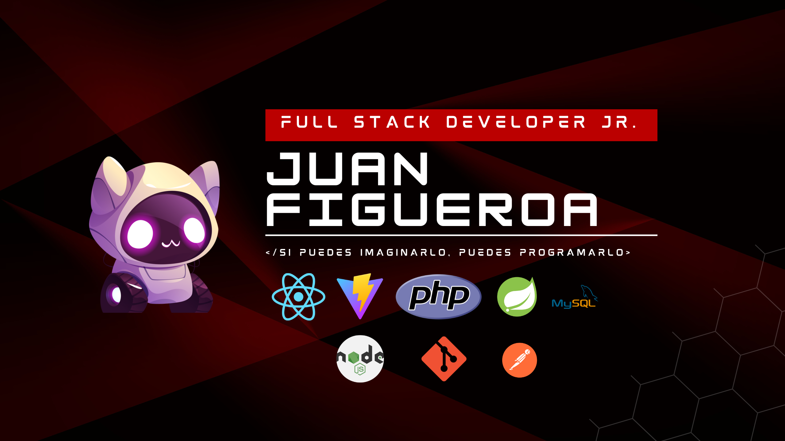

# Hey, I'm Juan Figue Vela

— *Full Stack Developer Jr.* Estudiante de Ingeniería de Sistemas e Informática (UTP, 10mo ciclo).  
Apasionado por el desarrollo web y la creación de soluciones prácticas que faciliten la vida de las personas. He trabajado con tecnologías modernas y frameworks robustos, desarrollando proyectos académicos y personales.

|  |  |  |  |
|---|---|---|---|
|  |  |  |  |

---

## 🚀 Proyectos destacados (Vercel)
### **Proyectos realizados con ALURA Latam**
- 🎮 **[Juego Secreto](https://juego-secreto-rust-kappa.vercel.app/)** – Juego interactivo con lógica en JavaScript.  
- 🔐 **[Decodificar Texto](https://decodificar-texto.vercel.app/)** – Herramienta para cifrar y descifrar texto.  
- 🎬 **[Cinema Alura](https://cinema-alura-six.vercel.app/)** – Sitio para gestión y visualización de películas. ([Repositorio](https://github.com/JFVela/cinema-alura))

### **Proyectos propios**
- 💼 **[Recibo de Honorario](https://recibo-honorario.vercel.app/)** – Sistema para que mi papá pueda generar cobros formales de manera sencilla.  
- 📚 **[Asistencias](https://asistencias-ten.vercel.app/)** – Aplicación para registrar asistencia y notas de estudiantes de primaria y secundaria.

---

## 📊 GitHub Stats
  

---

💡 *"Cada proyecto es una oportunidad para aprender, mejorar y crear algo que importe."*
